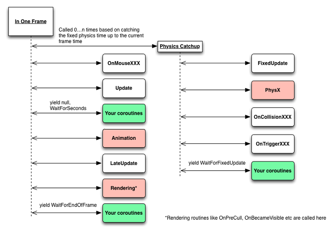

# study-unity-2019

2019년 유니티 엔진에 대한 학습 정리

## 코루틴
- 사실 코루틴을 초반에는 자주 사용하다가 나중에는 거의 사용하지 않는 단계 까지 갔는데.. 무조건 적인 배척보다는 사용해야 되는 부분에는 사용하는게 좋을 것 같아서 다시 한번 리마인드 하는 부분에서 정리
- 시간의 흐름이 중요한 로직을 작성할 때 코루틴은 매우 강력하면서도 심플하게 코딩할 수 있도록 도와준다.
- UI나 사운드 애니메이션 등의 연출쪽에 코루틴을 많이 사용
- 튜토리얼이나 컷신등에도 사용시 괜찮은 효과를 가져올 수 있다.

### 코루틴 호출 순서
- DelayedCall!
- null : update 구문의 수행이 완료될때까지 대기
- WaitForEndOfFrame : 현재 프레임의 렌더링 작업이 끝날 때까지 대기
- WaitForFixedUpdate : FixedUpdate 구문의 수행이 완료될 때까지 대기
- WaitForSeconds : 지정한 초만큼 대기한다.
- WaitUntil : 조건이 거짓인 동안 대기한다.
- WaitWhile : 조건이 참인 동안 대기한다.

### 코루틴 & 가비지 컬렉터
- StartCorouine() 함수 호출시 소량의 가비지 컬렉터 발생
- yield return new 같은 경우 가비지 컬렉터 발생

### 참고
- https://docs.unity3d.com/Manual/Coroutines.html
- http://answers.unity3d.com/questions/525854/is-using-coroutines-actually-faster-than-update.html
